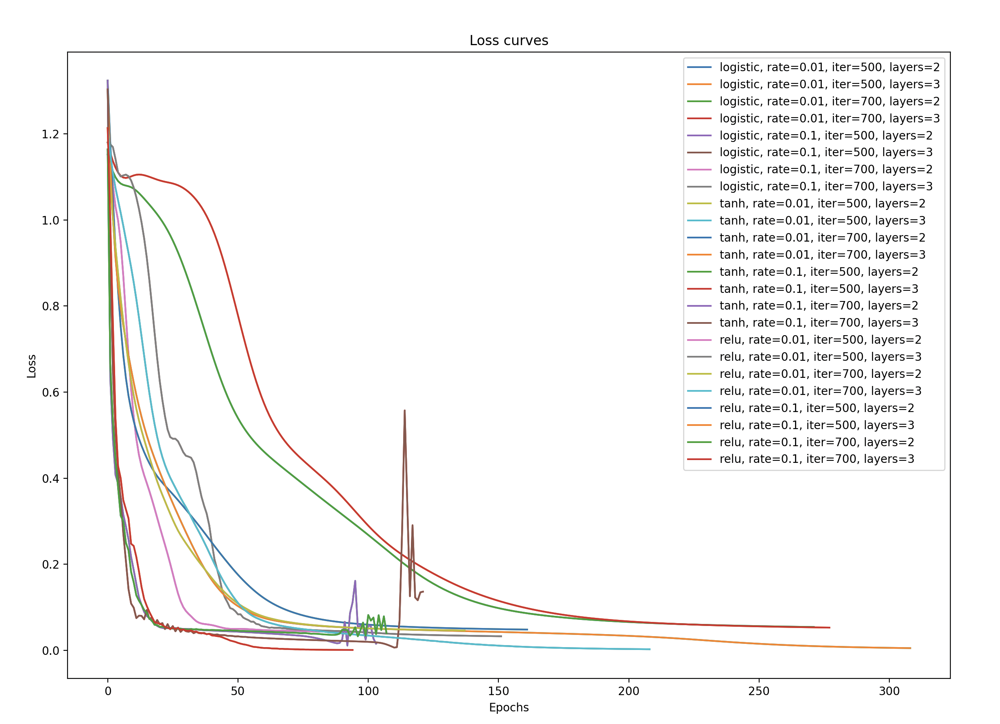

# Donghwan An
## _Assignment 2: Neural Networks_

To run, enter:
```sh
    python3 neuralNet.py
```

I am using the iris data set provided by the dataset package from the Sklearn module.
There's no online resource for grabbing the data, so it should be able to run as long as the Skcit-learn
module is installed in the environment

Dataset is in this link:
https://archive.ics.uci.edu/dataset/53/iris

## Report Summary
All three, tanh, log, and ReLu had perfect scores with test accuracy of 1.0.
However, the Logistic Activation Function seemed to have performed the best because the loss function was the lowest at .00423182 with a test accuracy of 1.0

## Model History Plots


## Model History in Tabular Form
| activation   |   learning_rate |   max_iterations |   num_hidden_layers |   train_acc |   test_acc |   train_loss |   test_loss |
|:-------------|----------------:|-----------------:|--------------------:|------------:|-----------:|-------------:|------------:|
| logistic     |            0.01 |              500 |                   2 |    0.983333 |   1        |  0.0538601   |  0.0271528  |
| logistic     |            0.01 |              500 |                   3 |    0.983333 |   1        |  0.052475    |  0.0205571  |
| logistic     |            0.01 |              700 |                   2 |    0.983333 |   1        |  0.0538601   |  0.0271528  |
| logistic     |            0.01 |              700 |                   3 |    0.983333 |   1        |  0.052475    |  0.0205571  |
| logistic     |            0.1  |              500 |                   2 |    0.983333 |   0.966667 |  0.0421272   |  0.0432412  |
| logistic     |            0.1  |              500 |                   3 |    0.991667 |   1        |  0.0320156   |  0.00423182 |
| logistic     |            0.1  |              700 |                   2 |    0.983333 |   0.966667 |  0.0421272   |  0.0432412  |
| logistic     |            0.1  |              700 |                   3 |    0.991667 |   1        |  0.0320156   |  0.00423182 |
| tanh         |            0.01 |              500 |                   2 |    0.983333 |   1        |  0.0480393   |  0.0213785  |
| tanh         |            0.01 |              500 |                   3 |    1        |   1        |  0.00488384  |  0.00766781 |
| tanh         |            0.01 |              700 |                   2 |    0.983333 |   1        |  0.0480393   |  0.0213785  |
| tanh         |            0.01 |              700 |                   3 |    1        |   1        |  0.00488384  |  0.00766781 |
| tanh         |            0.1  |              500 |                   2 |    0.966667 |   0.933333 |  0.0472789   |  0.306194   |
| tanh         |            0.1  |              500 |                   3 |    0.95     |   0.933333 |  0.12721     |  0.0940584  |
| tanh         |            0.1  |              700 |                   2 |    0.966667 |   0.933333 |  0.0472789   |  0.306194   |
| tanh         |            0.1  |              700 |                   3 |    0.95     |   0.933333 |  0.12721     |  0.0940584  |
| relu         |            0.01 |              500 |                   2 |    0.983333 |   1        |  0.0458852   |  0.0176224  |
| relu         |            0.01 |              500 |                   3 |    1        |   0.966667 |  0.00239453  |  0.166111   |
| relu         |            0.01 |              700 |                   2 |    0.983333 |   1        |  0.0458852   |  0.0176224  |
| relu         |            0.01 |              700 |                   3 |    1        |   0.966667 |  0.00239453  |  0.166111   |
| relu         |            0.1  |              500 |                   2 |    0.975    |   0.966667 |  0.0599268   |  0.109638   |
| relu         |            0.1  |              500 |                   3 |    1        |   0.966667 |  0.000626271 |  0.0538141  |
| relu         |            0.1  |              700 |                   2 |    0.975    |   0.966667 |  0.0599268   |  0.109638   |
| relu         |            0.1  |              700 |                   3 |    1        |   0.966667 |  0.000626271 |  0.0538141  |